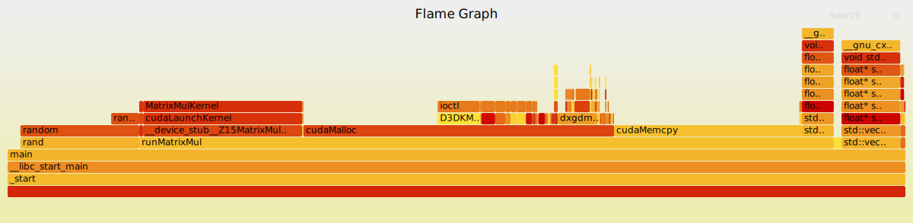

# cuda-flame-graph

Это тестовая версия профилировщика для построения флейм графов cuda программ. Тут коротко будет описано что в целом сделано и как с этим всем работать.

## Сборка
Для сборки проекта выполните:

```
mkdir build && cd build
```

Затем:

```
cmake ..
make -j16
```

## Пример запуска

Запустите профайлер на одном из собранных семплов (например matrixMul):

```
./pti_loader -f 997 samples/matrixMul/matrixMul > output.folded
```

В файле будет весь стек вызовов программы

Доступные флаги:
* -h (--help) - хелпа
* -f (--freq) - частота семплирования
* -s (--show) - показать оверхед профилировщика

PTI_DEBUG - режим фулл вывода (по приколу)

## Визуализация
Для визуализации клонируйте себе репозиторий __[FlameGraph](https://github.com/brendangregg/FlameGraph)__ Брендана Грегга (рядом с проектом профилировщика)

```
git clone git@github.com:brendangregg/FlameGraph.git
```

Затем прогоните полученный output.folded через flamegraph.pl 
(пример как запустить из директории проекта из папки build):

```
../../FlameGraph/flamegraph.pl output.folded > output.svg
```

Получился итоговый флейм граф `output.svg`:


## Коротко о самом профилировщике (потом)
